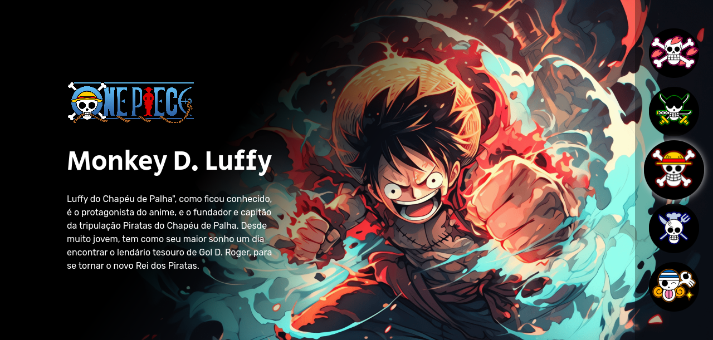
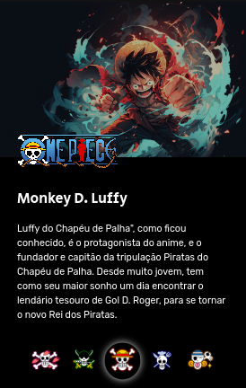

## Index

- [Overview](#overview)
       - [Screenshot](#screenshot)
       - [Links](#links)
- [My process](#my-process)
       - [Built with](#built with)
- [Author](#author)

## Overview

This project was created during the “From 0 to the hired programmer” event on the “dev em dobro” channel by twins Ricardo and Roberto Dias.

### Print Screen

###Links
- Active website URL: [View Site](https://otaviano-manoel.github.io/Project-One-Piece/)

## My process

### Built with

