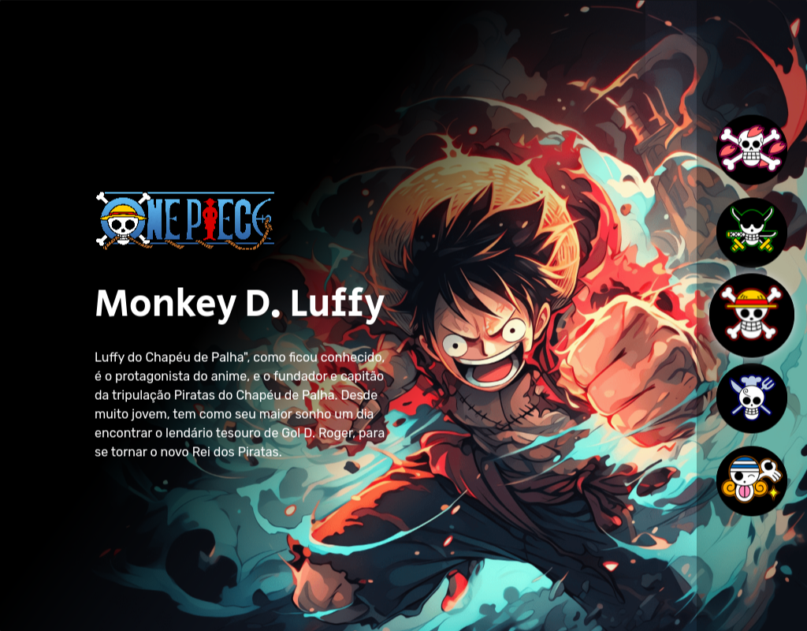
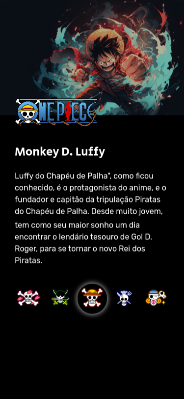

# Dev-em-Dobro - Project-One-Piece

This project was developed during the "From 0 to Hired Programmer" week, organized by the twins Ricardo and Roberto Dias.

## Table of contents

- [Overview](#overview)
  - [The challenge](#the-site)
  - [Screenshot](#screenshot)
  - [Links](#links)
- [My process](#my-process)
  - [Built with](#built-with)
  - [What I learned](#what-i-learned)
  - [Continued development](#continued-development)

## Overview

### The site

The website features a cover of a One Piece character and a brief description of the character. By clicking on the icons, it's possible to switch to a different character.

### Screenshot

### Links

- Live Site URL: [Live site URL here](https://otaviano-manoel.github.io/Project-One-Piece/)

## My process

### Built with

<code></code>
<code></code>
<code></code>

### What I learned

A brief introduction for the course I've chosen to study HTML, CSS, and JavaScript.

### Continued development

I will continue my studies of HTML and CSS through the [DevQuest](https://devemdobro.com/matriculas-abertas/) course.